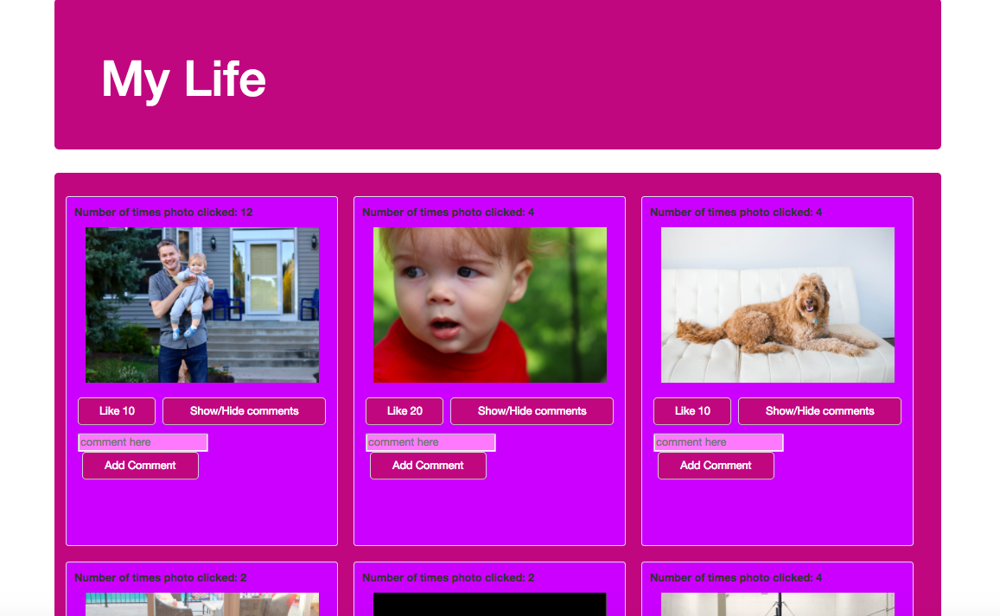
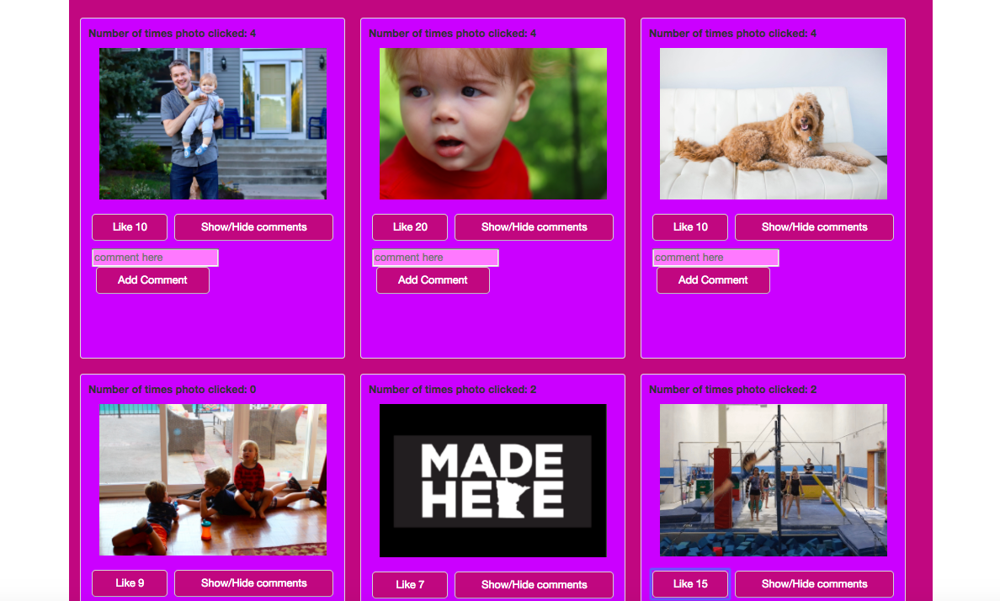

## Facebook for Myself

Facebook for Myself is the first application I built using AngularJS.  While not perfect - it was a step in a great learning process!

Facebook for Myself shows pictures of significance to me.  When clicking upon a photo you can read a brief caption of why I chose to display the photo.  Users can also star my photos as many times as they would like - and the number of stars is shown.

[A link to the live demo is found here.](https://pacific-citadel-43710.herokuapp.com/)

## Built With

- PostgreSQL
- Express
- AngularJS 
- Node.js
- Moment.js
- Bootstrap

## Getting Started

These instructions will get you a copy of the project up and running on your local machine for development and testing purposes. See deployment for notes on how to deploy the on a live system.

### Prerequisites

- [Node.js](https://nodejs.org/en/)
- [AngularJS](https://angularjs.org/)
- [PostgreSQL](https://www.postgresql.org/)
- [Express](http://expressjs.com/)
- [Bootstrap](https://getbootstrap.com/docs/3.3/)

### Installing

Steps to get the development environment running.

In a terminal window, navigate to the project folder once saved on your computer.
- Run `npm install`
- `npm start`

View on port 5000.

## Screen Shot

### Completed Features

High level list of items completed.

- [x] When you click on a picture it switches to a caption and vice versa.
- [x] Users can like a photo as many times as they want.
- [x] Users can leave a comment.
- [x] Users can show and hide comments.

